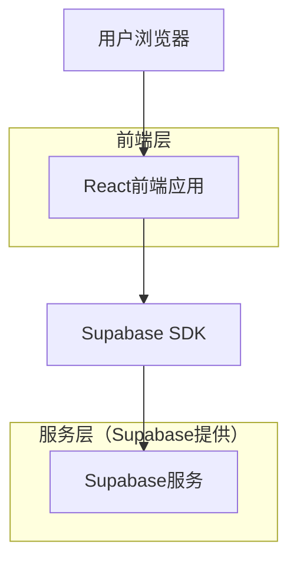
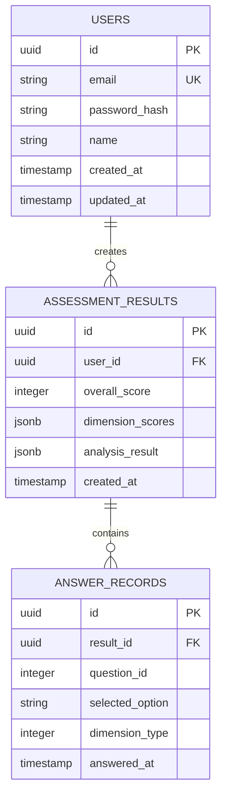

## 1. 架构设计



## 2. 技术栈描述

- **前端**: React@18 + TailwindCSS@3 + Vite
- **后端**: Supabase (集成认证、数据库、存储)
- **状态管理**: React Context + useReducer
- **图表库**: Chart.js + react-chartjs-2 (用于雷达图)
- **动画库**: Framer Motion (页面过渡动画)

## 3. 路由定义

| 路由 | 用途 |
|-------|---------|
| / | 欢迎页面，展示产品介绍和开始按钮 |
| /assessment | 测评页面，显示问题和选项 |
| /result | 结果页面，展示能力分析和建议 |
| /statistics | 统计页面，群体数据对比 |
| /demo | 演示模式，无需登录查看统计数据 |

## 4. 数据模型

### 4.1 数据库实体关系图



### 4.2 数据定义语言

**用户表 (users)**
```sql
-- 创建用户表
CREATE TABLE users (
    id UUID PRIMARY KEY DEFAULT gen_random_uuid(),
    email VARCHAR(255) UNIQUE NOT NULL,
    password_hash VARCHAR(255) NOT NULL,
    name VARCHAR(100) NOT NULL,
    created_at TIMESTAMP WITH TIME ZONE DEFAULT NOW(),
    updated_at TIMESTAMP WITH TIME ZONE DEFAULT NOW()
);

-- 创建索引
CREATE INDEX idx_users_email ON users(email);
CREATE INDEX idx_users_created_at ON users(created_at DESC);
```

**测评结果表 (assessment_results)**
```sql
-- 创建测评结果表
CREATE TABLE assessment_results (
    id UUID PRIMARY KEY DEFAULT gen_random_uuid(),
    user_id UUID REFERENCES users(id) ON DELETE CASCADE,
    overall_score INTEGER NOT NULL CHECK (overall_score >= 0 AND overall_score <= 100),
    dimension_scores JSONB NOT NULL, -- 存储五维能力得分
    analysis_result JSONB NOT NULL, -- 存储详细分析结果
    created_at TIMESTAMP WITH TIME ZONE DEFAULT NOW()
);

-- 创建索引
CREATE INDEX idx_assessment_results_user_id ON assessment_results(user_id);
CREATE INDEX idx_assessment_results_created_at ON assessment_results(created_at DESC);
```

**答题记录表 (answer_records)**
```sql
-- 创建答题记录表
CREATE TABLE answer_records (
    id UUID PRIMARY KEY DEFAULT gen_random_uuid(),
    result_id UUID REFERENCES assessment_results(id) ON DELETE CASCADE,
    question_id INTEGER NOT NULL,
    selected_option VARCHAR(10) NOT NULL,
    dimension_type INTEGER NOT NULL, -- 1-5代表五个维度
    answered_at TIMESTAMP WITH TIME ZONE DEFAULT NOW()
);

-- 创建索引
CREATE INDEX idx_answer_records_result_id ON answer_records(result_id);
CREATE INDEX idx_answer_records_question_id ON answer_records(question_id);
```

### 4.3 Supabase权限设置

```sql
-- 匿名用户权限（基本读取权限）
GRANT SELECT ON assessment_results TO anon;
GRANT SELECT ON answer_records TO anon;

-- 认证用户权限（完整权限）
GRANT ALL PRIVILEGES ON users TO authenticated;
GRANT ALL PRIVILEGES ON assessment_results TO authenticated;
GRANT ALL PRIVILEGES ON answer_records TO authenticated;

-- RLS策略（行级安全）
ALTER TABLE assessment_results ENABLE ROW LEVEL SECURITY;
ALTER TABLE answer_records ENABLE ROW LEVEL SECURITY;

-- 用户只能查看自己的测评结果
CREATE POLICY "用户查看自己的测评结果" ON assessment_results
    FOR SELECT USING (auth.uid() = user_id);

-- 用户只能查看自己的答题记录
CREATE POLICY "用户查看自己的答题记录" ON answer_records
    FOR SELECT USING (EXISTS (
        SELECT 1 FROM assessment_results 
        WHERE id = result_id AND user_id = auth.uid()
    ));
```

## 5. 前端组件架构

### 5.1 核心组件结构
```
src/
├── components/
│   ├── common/
│   │   ├── Button.jsx          # 统一按钮组件
│   │   ├── Card.jsx            # 卡片容器组件
│   │   ├── ProgressBar.jsx     # 进度条组件
│   │   └── RadarChart.jsx      # 雷达图组件
│   ├── assessment/
│   │   ├── QuestionCard.jsx    # 问题卡片
│   │   ├── OptionList.jsx      # 选项列表
│   │   └── DimensionTag.jsx    # 维度标签
│   └── result/
│       ├── ScoreDisplay.jsx    # 分数展示
│       ├── AbilityRadar.jsx    # 能力雷达图
│       └── SuggestionList.jsx  # 建议列表
├── pages/
│   ├── Welcome.jsx
│   ├── Assessment.jsx
│   ├── Result.jsx
│   └── Statistics.jsx
├── hooks/
│   ├── useAssessment.js        # 测评逻辑钩子
│   └── useStatistics.js        # 统计数据钩子
└── utils/
    ├── assessment.js             # 测评算法
    └── constants.js              # 常量定义
```

### 5.2 状态管理设计
```javascript
// 测评状态结构
const assessmentState = {
  currentQuestion: 0,
  totalQuestions: 10,
  answers: [],
  dimensions: {
    awareness: 0,    // AI认知度
    usage: 0,        // 使用频率
    proficiency: 0, // 熟练程度
    integration: 0,   // 整合能力
    innovation: 0     // 创新能力
  },
  isCompleted: false,
  result: null
};
```

## 6. 测评算法设计

### 6.1 五维能力模型
- **AI认知度** (Awareness): 对AI技术的理解和认知程度
- **使用频率** (Usage): 在工作中使用AI工具的频率
- **熟练程度** (Proficiency): 掌握AI工具的深度和广度
- **整合能力** (Integration): 将AI工具整合到工作流程的能力
- **创新能力** (Innovation): 利用AI进行创新和解决问题的创造性

### 6.2 评分算法
```javascript
// 维度得分计算
function calculateDimensionScore(answers, dimension) {
  const dimensionAnswers = answers.filter(a => a.dimension === dimension);
  const rawScore = dimensionAnswers.reduce((sum, answer) => {
    return sum + getAnswerScore(answer.option);
  }, 0);
  
  return Math.round((rawScore / dimensionAnswers.length) * 20); // 转换为0-100分
}

// 总体得分计算
function calculateOverallScore(dimensionScores) {
  const total = Object.values(dimensionScores).reduce((sum, score) => sum + score, 0);
  return Math.round(total / 5); // 五个维度的平均分
}
```

## 7. 性能优化策略

### 7.1 前端优化
- **代码分割**: 按页面进行代码分割，减少初始加载时间
- **图片优化**: 使用WebP格式，按需加载图标资源
- **缓存策略**: 利用浏览器缓存静态资源，Supabase缓存API响应
- **动画优化**: 使用CSS动画替代JavaScript动画，提升性能

### 7.2 数据优化
- **分页加载**: 历史测评记录分页展示
- **数据压缩**: 测评结果数据压缩存储
- **索引优化**: 为常用查询字段建立索引
- **缓存机制**: 热门统计数据缓存，减少数据库查询