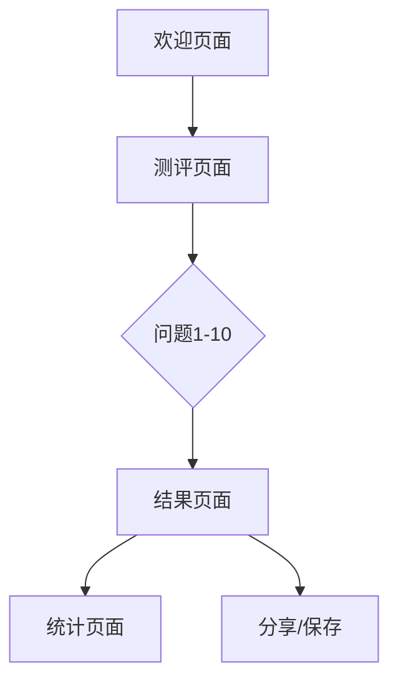

## 1. 产品概述
职场AI效能潜力评估工具，通过10道精准题目分析用户的AI五维能力，为职场人士提供个性化的AI技能进阶建议，帮助用户在AI时代成为"超级个体"。

目标用户：职场人士、管理者、HR从业者，希望在AI时代提升个人竞争力的专业人士。

## 2. 核心功能

### 2.1 用户角色
| 角色 | 注册方式 | 核心权限 |
|------|----------|----------|
| 测评用户 | 无需注册即可测评 | 完成AI能力评估、查看个人报告 |
| 注册用户 | 邮箱/手机号注册 | 保存测评历史、对比多次结果、查看详细分析 |

### 2.2 功能模块
AI效能评估产品包含以下核心页面：
1. **欢迎页面**：品牌展示、产品介绍、开始评估入口
2. **测评页面**：进度显示、问题展示、选项交互
3. **结果页面**：能力雷达图、详细分析、进阶建议
4. **统计页面**：群体数据展示、对比分析

### 2.3 页面详情
| 页面名称 | 模块名称 | 功能描述 |
|-----------|-------------|-------------|
| 欢迎页面 | 品牌展示区 | 展示AI评估工具logo和标题，使用紫色渐变圆形图标 |
| 欢迎页面 | 产品介绍区 | 显示"职场AI效能潜力评估"标题和工具价值说明 |
| 欢迎页面 | 行动引导区 | 显示"开始评估"按钮和预计耗时提示 |
| 欢迎页面 | 辅助功能区 | 提供"演示模式"查看群体统计数据的入口 |
| 测评页面 | 进度指示器 | 显示当前问题编号和总体进度条 |
| 测评页面 | 问题分类标签 | 显示当前问题所属的能力维度标签 |
| 测评页面 | 问题展示区 | 清晰展示问题文本，支持图文结合 |
| 测评页面 | 选项交互区 | 提供4个选项卡片，支持点击选择 |
| 结果页面 | 能力雷达图 | 五维能力可视化展示 |
| 结果页面 | 详细分析区 | 各维度得分和文字解读 |
| 结果页面 | 进阶建议区 | 个性化提升建议和学习路径 |
| 统计页面 | 群体对比 | 展示用户与行业平均水平的对比 |
| 统计页面 | 能力分布 | 可视化展示各能力维度的人群分布 |

## 3. 核心流程
用户操作流程：
1. 用户进入欢迎页面，了解产品价值
2. 点击"开始评估"进入测评流程
3. 依次回答10道问题，系统实时记录选择
4. 完成测评后生成个性化能力报告
5. 查看详细分析和进阶建议
6. 可选择查看群体统计数据进行对比

## 4. 用户界面设计

### 4.1 设计规范
**色彩系统**：
- 主色调：紫色渐变（#8B5CF6 → #A855F7）
- 辅助色：深蓝紫色（#6366F1）
- 中性色：深灰文字（#1F2937）、浅灰边框（#E5E7EB）
- 背景色：纯白（#FFFFFF）

**视觉元素**：
- 按钮样式：圆角矩形（border-radius: 9999px），紫色背景配白色文字
- 卡片设计：圆角卡片（border-radius: 12px），轻微阴影（box-shadow: 0 4px 6px -1px rgba(0, 0, 0, 0.1)）
- 图标风格：线性图标，紫色主题，圆形外框
- 字体系统：主标题加粗，正文常规，辅助文字细体

**交互反馈**：
- 悬停效果：按钮和卡片悬停时轻微放大和阴影增强
- 选中状态：选项卡片选中时边框变紫、背景淡紫
- 进度动画：进度条平滑填充，问题切换有轻微滑动效果

### 4.2 页面设计详解
| 页面名称 | 模块名称 | UI元素规范 |
|-----------|-------------|-------------|
| 欢迎页面 | 品牌展示区 | 居中圆形图标，紫色渐变环形，内部为灯泡/星星图案，尺寸80×80px |
| 欢迎页面 | 主标题 | "职场AI效能潜力评估"，字体大小32px，字重700，颜色#1F2937 |
| 欢迎页面 | 描述文字 | 两行描述文字，字体大小16px，颜色#6B7280，行高1.5 |
| 欢迎页面 | CTA按钮 | "开始评估"，紫色渐变背景，白色文字，高度48px，内边距16px 32px |
| 欢迎页面 | 辅助信息 | 预计耗时2分钟，字体14px，颜色#9CA3AF |
| 测评页面 | 进度条 | 顶部细进度条，紫色填充，高度4px，圆角2px |
| 测评页面 | 问题标签 | "人工智能卷入度"标签，紫色边框，紫色文字，圆角16px |
| 测评页面 | 问题文本 | 字体大小20px，字重600，颜色#1F2937，左对齐 |
| 测评页面 | 选项卡片 | 白色背景，浅灰边框，圆角8px，内边距16px，悬停效果 |
| 结果页面 | 雷达图 | 五维能力雷达图，紫色填充区域，网格线浅灰 |
| 结果页面 | 得分展示 | 大数字显示总分，紫色文字，下方维度得分条形图 |

### 4.3 响应式设计
**桌面优先设计**：
- 最大宽度1200px，居中布局
- 欢迎页面内容垂直居中，左右留白自适应
- 测评页面左右分栏，问题区占60%，进度区占40%

**移动端适配**：
-  breakpoint: 768px，转为单列布局
- 字体大小适当缩小，按钮高度调整为44px便于触控
- 选项卡片垂直排列，增加触控区域

**触控优化**：
- 所有可点击元素最小44×44px触控区域
- 增加触控反馈动画，提升交互体验
- 滑动切换问题支持，适配移动端操作习惯